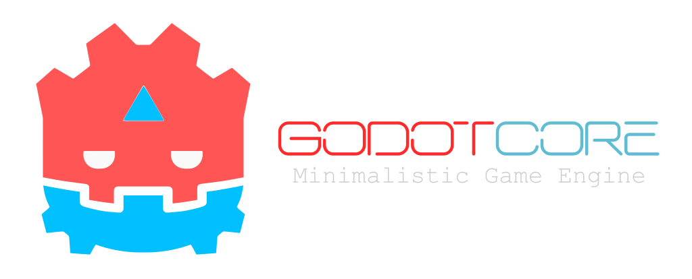

  

# Godot Core : Purification for Evolution

**Godot Core** is a base engine powered by [Jenova Framework](https://github.com/Jenova-Framework), designed for **Windows** developers who want to build their own customized engines. 

Godot Core is a purged and purified version of Godot Engine with all unnecessary features removed. It comes as an extracted core with Jenova Core and the Jenova Code IDE deeply integrated into the engine.

This engine variation is built for developers pursuing bespoke, design-driven editions. It is not suited to general-purpose game development.

## What's Removed

- OpenGL and Mobile Renderers
- Translations, AccessKit and Accessibility Features
- Documentation and Help Systems
- Jolt Physics, 2D Physics (can be enabled)
- GDScript, Script Editor and Script Debugger
- Shader Editor and Visual Shader Editor
- Android, Linux, macOS, iOS, Web and VisionOS platforms
- Project Manager, Default Modules, FBX/GLTF Importers and more...

## What's Added

- Jenova Framework (Jenova Runtime/Core v0.3.9.0)
- Jenova Code IDE (Heavily Modified VSCodium)
- Blade Script Language (Base/Prototype)

## How to Build/Use

1. Download Jenova Core Library from [here](../../releases/tag/jenova-core-library).
2. Extract `Jenova.Core.Win64.MSVC.jnvlib` in `\modules\jenova_core\library`
3. Use `_build.bat` or `_generate-vs.bat` to build the engine.
4. After building the engine, Download Jenova Code IDE release from [here](../..//releases/tag/jenova-code-ide).
5. Extract the IDE in `\bin\tools\jnv_ide`
6. Create a directory with a empty file `project.godot` inside as Project directory.
7. Launch editor using `godot.core.exe --editor --path <project_directory_path>`

---
##### Additional modifications © 2025 Hamid Memar. Based on Godot Engine © 2014–present Juan Linietsky, Ariel Manzur and contributors.

